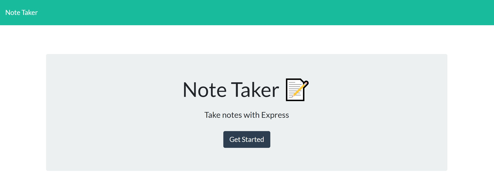
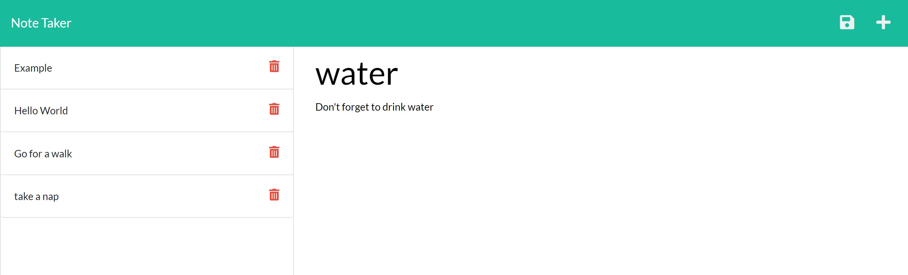

# note-pad  
## Description
The following is an application that allows the user to write and save notes. Once the user starts the application they are then taken to the index.html, this page will have a button to get started. When the button is clicked the user is then brought to the note page. The user is then given access to input a note title and text content. When the user saves the note it will be placed in the left column and can then be clicked on to view the note details. If the user no longer wants the note, simple press the trash/delete button to remove the note. 

# Table of contents
- [Instructions](#instructions)
- [Usage](#usage)
- [Contributions](#contributions)
- [Live Deployment](#live-deployment)
- [Questions](#questions)
- [License](#license)
- [Test](#test)
- [Credits](#credits)

## Instructions
- Clone the repository in the terminal 
- Navigate to the file within the terminal and perform a "npm install"
- Then, type "node server.js" this will start the server.
- open the localhost address within a browser
Once these steps are done, the user can then write notes and save them.  
### Requirments 
* Node.js
* IDE preferably (VS Code)
* Web browser (chrome is ideal)
## Usage
The application allows the user to write notes. Which can then be saved by clicking the icon in the top left corner. Once the note is no longer needed, the user can then click the trask icon located next to the note to remove it. Click on the note to view the text content.

## Constributions
* [Richard Ferry](https://www.linkedin.com/in/richard-ferry-83120514b/)
### Technologies
* HTML
* JavaScript
* Uuid
* Express
* Node.JS
* Heroku

## Live Deployment
- https://quiet-oasis-75616.herokuapp.com/
## Questions
If there are questions, reach out to: Richard Ferry
* [LinkedIn](https://www.linkedin.com/in/richard-ferry-83120514b/)
* [GitHub](https://github.com/rich-f-p)
* [email](mailto:richardfpro864@gmail.com)

## License
* [License: MIT](https://opensource.org/licenses/MIT) : click to learn more

## Test
* All test done using Insomnia (for request api's) [Insomnia](https://insomnia.rest/)

### Credits
* Starter files provided by UC Berkley Coding BootCamp